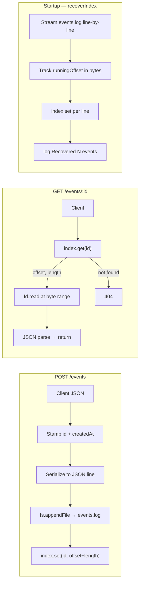

# Append-Only Event Store

A small HTTP service that stores events in a flat append-only log file and reads them back by ID using direct byte-range seeks. No database, no JSON rewrites — the file **is** the database.

---

## Setup

**Prerequisites:** Node.js 18+

```bash
npm install
npm start
```

The server starts on port 3100 (override with `PORT=xxxx npm start`).

On every startup you will see a recovery line like:

```
Recovered 3 event(s) from events.log
Event store listening on http://localhost:3000
```

If `events.log` does not exist yet (first boot), you will see:

```
No events.log found — starting fresh.
Event store listening on http://localhost:3000
```

---

## API — curl commands

### POST /events

Accept any JSON body. Stamps `id` (UUID v4) and `createdAt`, appends to log, returns 201.

```bash
curl -X POST http://localhost:3000/events \
  -H "Content-Type: application/json" \
  -d '{"type":"user.signup","userId":"alice"}'
```

Response `201`:

```json
{
  "id": "cb1c9c73-69b5-4df0-a92f-023a208e04c9",
  "createdAt": "2026-05-31T11:39:06.599Z",
  "type": "user.signup",
  "userId": "alice"
}
```

### GET /events/:id

Looks up the in-memory index, seeks directly to the right byte range in `events.log`, returns the event.

```bash
curl http://localhost:3000/events/cb1c9c73-69b5-4df0-a92f-023a208e04c9
```

Response `200` — the stored event object.
Response `404` if the ID is not in the index:

```json
{ "error": "Event not found." }
```

### GET /stats

Returns the total number of events and the current byte size of `events.log`.

```bash
curl http://localhost:3000/stats
```

Response `200`:

```json
{ "total": 3, "bytes": 398 }
```

---

## Architecture

```
POST /events
  │
  ├─ stamp { id, createdAt }
  ├─ JSON.stringify → "{ ... }\n"
  ├─ fs.stat(events.log) → current EOF = offset
  ├─ fs.appendFile(events.log, line + "\n")
  └─ index.set(id, { offset, length })  ← in-memory Map

GET /events/:id
  │
  ├─ index.get(id) → { offset, length }   (O(1))
  ├─ fd.read(buffer, 0, length, offset)   ← single seek, no scan
  └─ JSON.parse(buffer) → return event

Startup (recoverIndex)
  │
  ├─ readline stream over events.log
  ├─ track runningOffset (bytes, not chars)
  ├─ for each line → index.set(event.id, { offset, length })
  └─ console.log("Recovered N event(s) from events.log")
```

### Mermaid diagram




---

## Core concepts in my own words

### Why append-only is safer than overwriting in place

When you overwrite a record in a file, the operating system has to:

1. Seek to the right position
2. Write the new bytes
3. (Possibly) truncate or pad to match the old length

If your process dies at step 2, you now have a file with half-old, half-new data — it is corrupt. You cannot tell what state it was in before the crash.

Appending is different. A write either completes fully or not at all because the OS guarantees that a single `write()` syscall is atomic up to `PIPE_BUF` bytes on most systems. If the process dies before the write, the file still ends where it was before the attempt. If it dies mid-write, the worst case is a single malformed line at the end, which the recovery code can detect and skip. Everything before that line is untouched. This is exactly how databases like Postgres and SQLite implement their WAL (Write-Ahead Log).

### Why an index makes reads fast

Without the index, reading event `X` means scanning the whole file line by line until you find `"id":"X"`. That is O(n) — it gets slower the more events you have.

The in-memory `Map<id, { offset, length }>` maps every ID directly to the byte position of that record in the file. A read becomes:

1. `Map.get(id)` — O(1) hash lookup
2. `fd.read(buffer, 0, length, offset)` — one OS seek + one read of exactly `length` bytes

It never matters how large `events.log` is; reads are always O(1).

---

## Recovery screenshot

After posting 3 events, stopping the server, and restarting:

```
Recovered 3 event(s) from events.log
Event store listening on http://localhost:3000
```

*(Add your own screenshot here for the submission.)*

---

## What I struggled with

- **Byte offsets vs character lengths.** JavaScript strings are UTF-16 internally. Using `line.length` to track offsets in a UTF-8 file gives wrong positions the moment any character is outside ASCII (e.g. an emoji spans 3–4 bytes in UTF-8 but counts as 1 or 2 in `line.length`). Switching to `Buffer.byteLength(line, 'utf8')` throughout fixed this.
- **The +1 for the newline during recovery.** `readline` strips the `\n` from each line it emits. If you do not add 1 back when advancing `runningOffset`, every subsequent offset is off by 1 per line — a creeping bug that only surfaces on the second or later event.
- **Race between recovery and the first request.** Because `recoverIndex` is async, using `app.listen` before `await recoverIndex()` meant the server could accept a write before the index was rebuilt. Moving the `app.listen` call to after the `await` eliminates the window.

---

## What I learned

- How append-only logs are the foundation of crash-safe storage (WAL, Kafka, Cassandra commitlog all work this way).
- How Node's `readline` works as an async iterator over a stream.
- Why `Buffer.byteLength` must be used instead of `String.prototype.length` for any byte-accurate file work.
- How `fd.read(buffer, 0, length, offset)` lets you seek into a file at a specific byte position — a capability I had never used directly before.
- The practical difference between O(n) file scans and O(1) index-backed seeks, and why it matters at scale.

---

## Resources consulted

- [Node.js `fs` docs — `fs.open`, `fileHandle.read](https://nodejs.org/api/fs.html)`
- [Node.js `readline` async iterator](https://nodejs.org/api/readline.html#readline_readline_createinterface_options)
- [Why databases use append-only logs (Martin Kleppmann, DDIA)](https://dataintensive.net/)
- [Buffer.byteLength vs String.length in Node.js](https://nodejs.org/api/buffer.html#static-method-bufferbytelengthstring-encoding)

---

## Why this project made me a better backend developer

Before this, I thought of a database as something external — Postgres, MongoDB, a managed service. Now I understand that every database is just a thin abstraction over an append-only file. The crash-safety guarantees that Postgres advertises come from the same principle I implemented here: write to the log first, then update state.

I will think differently about two production scenarios:

1. **Data durability conversations.** When someone says "we might lose data on a crash," I now understand concretely why: they are overwriting in place rather than appending first. The solution is a WAL, not more hardware.
2. **Read performance.** Whenever I see a service doing `SELECT * WHERE id = ?` on a large table with no index, I think of this project — the solution is always an index that maps the ID to the physical location of the row, which is exactly what `Map<id, { offset, length }>` is.

